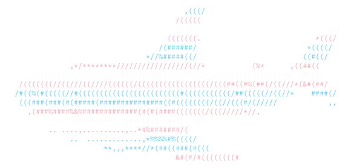

<p align="center">
  
</p>
<h1 align="center">BLÅHAJ</h1>
<h2 align="center">Gay sharks at your local terminal</h2>
<br />


# What is BLÅHAJ?

Apart from [a cute cuddly shark plushie from IKEA](https://www.ikea.com/us/en/p/blahaj-soft-toy-shark-90373590/), BLÅHAJ is a lolcat-like CLI tool that colorizes your input, shows flags and prints colorful sharks!

It has a wide variety of flags/colors to choose from and many options from flag size to whether to colorize by line, word or character.

This tool was initially written by [GeopJr](https://github.com/GeopJr/BLAHAJ) using crystal, but I shamelessly stole his idea (please don't sue me qwq) and rewrote the concept in rust (purely for learning ofc), so all the credit is due to them :3

# Installation

## Pre-built

You can download one of the statically-linked pre-built binaries from the [releases page](https://github.com/kqcl/blahaj-rs/releases/latest).

## Building

### Prerequesites

- [Rust](https://www.rust-lang.org/tools/install) installed.

### Building

Clone the repository and navigare to the project directory:
```bash
git clone https://github.com/kqcl/blahaj-rs.git
cd blahaj-rs
```
Build the project:
`cargo run build --release`

Run the project:
`cargo run --release -- [OPTIONS]`

Alternatively, you can use `make`:
```
make build
make run
```


# Examples

```
$ blahaj-rs -h
This application colorizes terminal output with pride flags.

Usage: blahaj-rs [OPTIONS]

Options:
  -f, --flag-name <flag-name>  This specifies the pride flag from the default register [default: trans]
  -l, --list                   Get a list of all the flags in the default register.
  -r, --random                 Chooses a random flag.
  -s, --sharky                 Print a cute blahaj into your console.
  -h, --help                   Print help
  -V, --version                Print version
```

# Attributions

[GeopJr](https://github.com/GeopJr/BLAHAJ)
